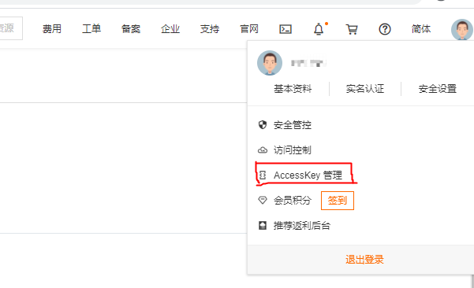
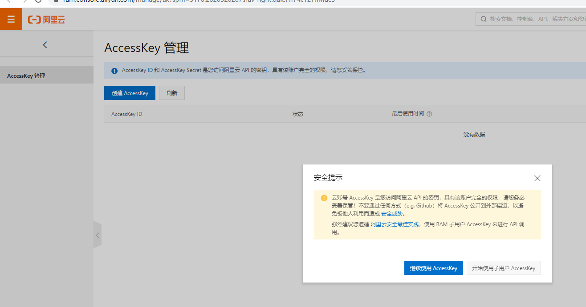
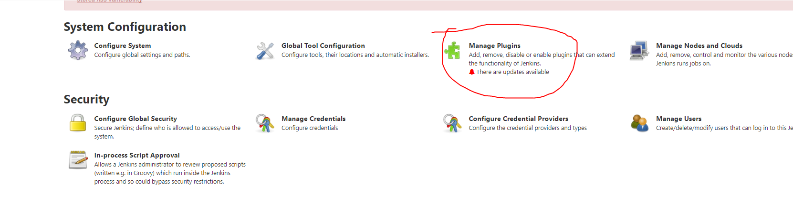
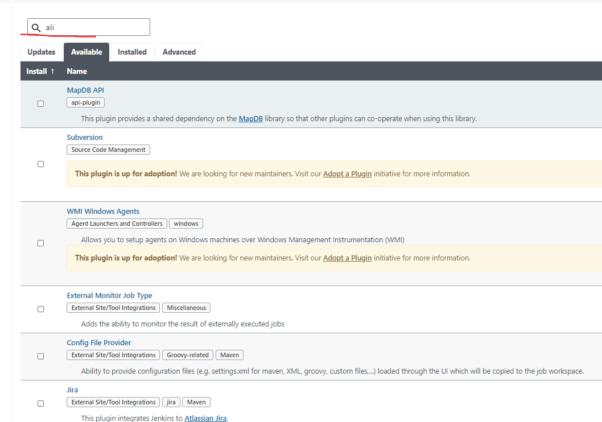
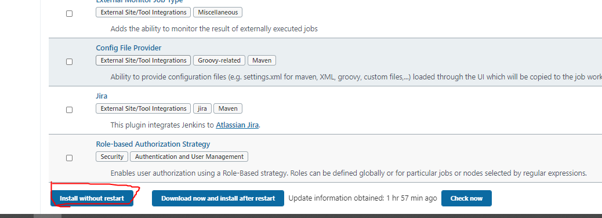
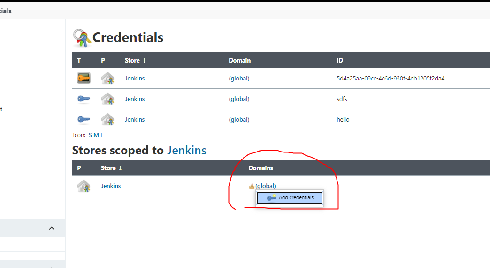
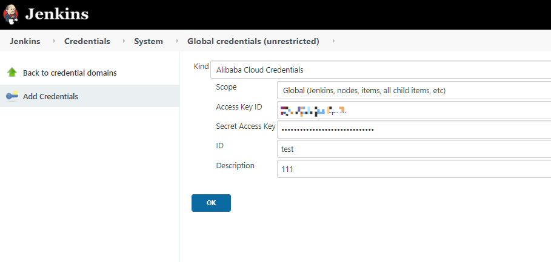

# alibabacloud credentials plugin

# Introduction
When you need to verify whether AK and SK match when using Alibaba cloud related products, 
you can use the alibabcloud credentials Jenkins plugin

# Usage

### Register account, get AK, SK

Step 1: before using alibabcloud credentials Jenkins, you need to register an alicloud account 
and log in to the alicloud console. ( https://homenew.console.aliyun.com/ )

Step 2: put the mouse in the user name area at the top right and select access keys from the 
shortcut menu that pops up.

Step 3: the system will pop up the security prompt dialog box, click continue to use accessKey,
the page will display accesskeyid and accesskeysecret

### Install Jenkins and the plugin

Once your Jenkins is installed, you can download alibab cloud credentials plugin for use

* You can navigate to "manage Jenkins" \ > "manage plugins"

* On the plug-in management page, enter "Alibaba cloud credentials" in the query box to query
 the plugin

* Scroll to the bottom and select "install without restart"

### Verify
Once you've installed the plugin, you can verify AK, SK or save it in "manage credentials"

